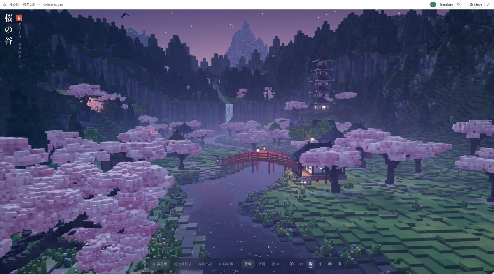
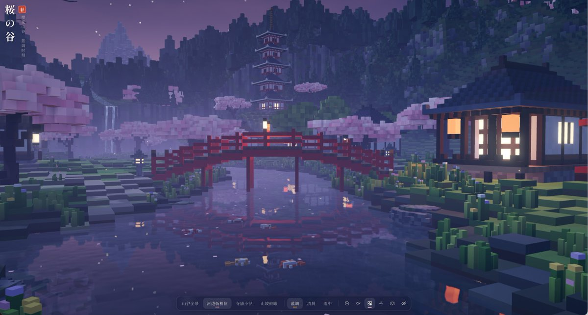
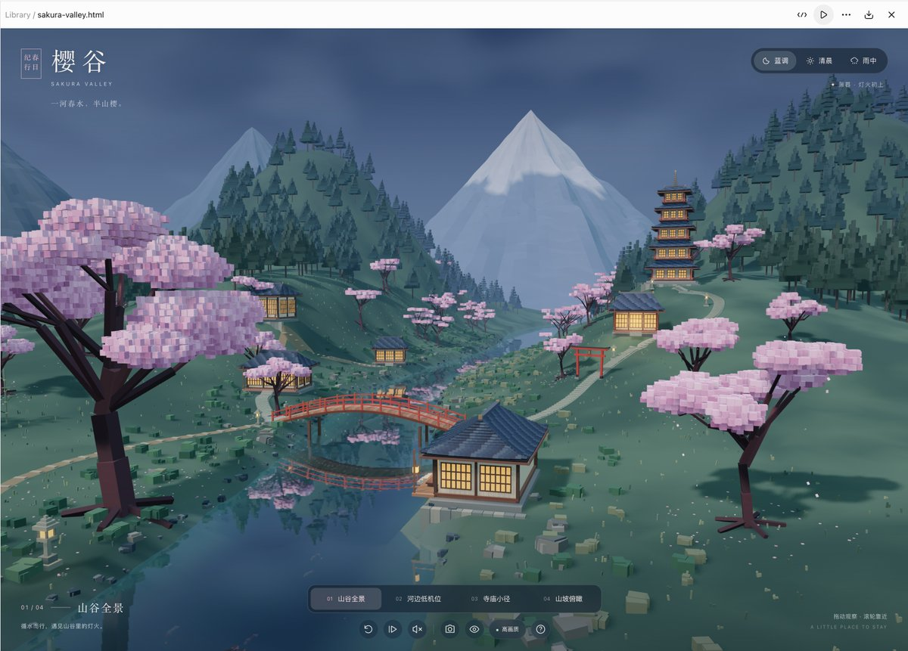
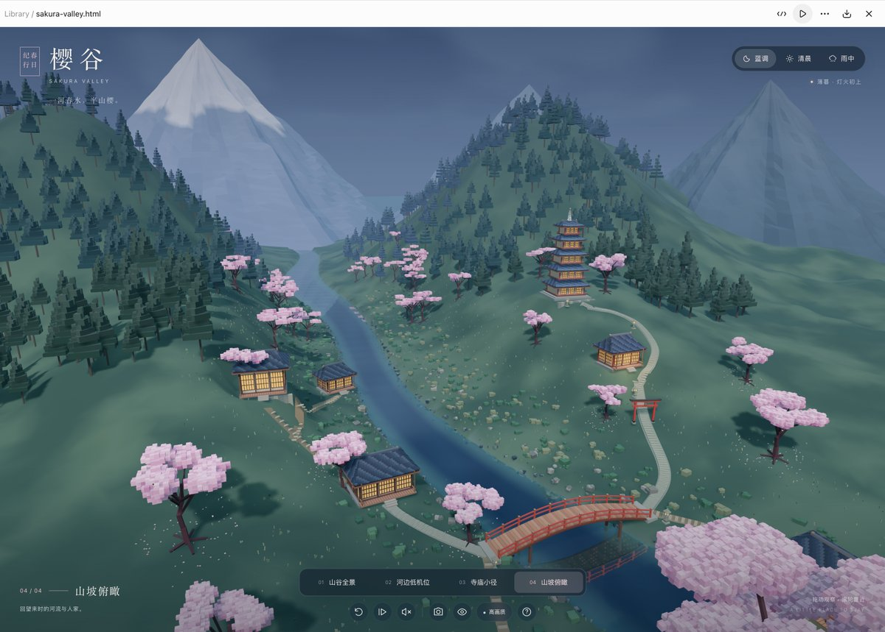

# Astra · プロンプト集 · Leadde.ai

[](README.md) [](README_zh.md) [](README_zh-TW.md) [](README_ja-JP.md) [](README_ko-KR.md) [](README_th-TH.md) [](README_vi-VN.md) [](README_hi-IN.md) [](README_es-ES.md) [-lightgrey)](README_es-419.md) [](README_de-DE.md) [](README_fr-FR.md) [](README_it-IT.md) [-lightgrey)](README_pt-BR.md) [](README_pt-PT.md) [](README_tr-TR.md)

**Best for:** Astra prompts for 3D scenes, Blender workflows, game assets, and agent-led visual production.

For PDF, PPT, SOP, training, and multilingual video workflows:
[Awesome Document-to-Video](https://github.com/LeaddeOpenLab/awesome-document-to-video)

> **高品質なプロンプトを毎日厳選**

AI画像・動画・3D制作の完全なプロンプトを紹介します。スタイル別に探し、多言語版と原作者の出典を確認できます。

[Leadde.ai を見る →](https://leadde.ai/?utm_source=github&utm_medium=readme&utm_campaign=prompt-library&utm_content=astra)

## Leadde.ai について

Leadde.ai は文書、スライド、テキストから、研修、新入社員教育、マーケティング向けのAIビジネス動画を作成するチームを支援します。

リポジトリにスターを付けて、毎日の厳選プロンプトから新しい創作のアイデアを見つけましょう。

**14** 件 · 最新の追加: **2026-09-23**

<a name="catalog"></a>

## カテゴリから探す

[シネマティック / フィルムスチル](#category-cinematic-film-still) · [イラスト](#category-illustration) · [コミック / グラフィックノベル](#category-comic-graphic-novel) · [3D レンダリング](#category-3d-render)

<a name="all-prompts"></a>

<a name="category-cinematic-film-still"></a>

## シネマティック / フィルムスチル

<a name="prompt-2097777121452347846"></a>

### リブート版『となりのサインフェルド』映画の可能性を描いた24枚のスクリーンキャプチャを含む、24フレームの絵コンテ画像を作成してください。

作者：[@VK10920178](https://x.com/VK10920178) · [元の投稿](https://x.com/VK10920178/status/2097777121452347846)

コミック / ストーリーボード · シネマティック / フィルムスチル · 配信済み

**概要:** リブート版『となりのサインフェルド』映画の可能性を描いた24枚のスクリーンキャプチャを含む、24フレームの絵コンテ画像を作成してください。


**プロンプト**

```text
リブート版『となりのサインフェルド』映画の可能性を描いた24枚のスクリーンキャプチャを含む、24フレームの絵コンテ画像を作成してください。
```

[↑ カテゴリに戻る](#catalog)

---

<a name="category-illustration"></a>

## イラスト

<a name="prompt-2096842636074312057"></a>

### 2枚の参照画像（アニメキャラとXプロフィールUI）をもとに、キャラがアイコン枠から抜け出して元の文字を剥ぎ取り清掃し、手書きのスローガンでページを占拠する15秒の定点2Dアニメーションを生成。

作者：[@Chengzilhy](https://x.com/Chengzilhy) · [元の投稿](https://x.com/Chengzilhy/status/2096842636074312057)

プロフィール / アバター · アプリ / Web デザイン · 写真撮影 · イラスト · キャラクター · 配信済み

元の投稿：[@Chengzilhy](https://x.com/Chengzilhy) · [元の投稿](https://x.com/Chengzilhy/status/2096456212246364322)

**概要:** 2枚の参照画像（アニメキャラとXプロフィールUI）をもとに、キャラがアイコン枠から抜け出して元の文字を剥ぎ取り清掃し、手書きのスローガンでページを占拠する15秒の定点2Dアニメーションを生成。


**プロンプト**

```text
【参照画像定義】
Image1＝Li Jiu'er（李韭二）アニメキャラクター｜唯一のキャラクター参照

Image1 は動画全体を通して唯一かつ最優先される人物のアイデンティティ、顔、髪型、服装、および画風のリファレンスです。

全編にわたり Image1 の Li Jiu'er における以下を厳格に維持すること：

識別可能な顔の特徴
顔のパーツの比率
ショートヘア
黒縁メガネ
濃い色の半袖トップス
濃い色の長ズボン
黒い靴
フラットでシンプルなカートゥーンイラストの質感
理性的でリラックスし、少しユーモアのある雰囲気

禁止事項：

実写化
3D化
別人化
髪型の変更
服装の変更
画風の変更
Image2＝Xプロフィールページのスクリーンショット｜唯一の背景およびレイアウト参照

Image2 は動画全体の唯一の背景、UI、レイアウト、構図のリファレンスです。

Image2 における以下を厳格に維持すること：

上部バナー画像
アバター丸枠の位置
白色のUI背景
すべてのボタン
アイコン
ページ構造
余白
色
比率

動画全体を通して、カメラは完全に固定されます。

X のプロフィールページは第1フレームから最終フレームまで常に正面、水平、フルスクリーン固定を保ち、ページの四辺は常に動画フレームと平行を保ちます。

ページ全体に対する以下の操作を禁止します：

拡大・縮小
平行移動
回転
傾き
パースペクティブの変化
再構成

ページ全体が左右に傾くことを禁止します。
ページが縮小して外側に新しい灰色の背景が現れることを禁止します。
指定された演出を除き、UIおよび背景の変更は不可とします。

【全体要件】

15秒、9:16縦型、固定カメラ、2Dアニメーション調のショート動画を生成してください。

動画全体において：

背景は常に Image2 の X プロフィール画面スクリーンショット

動くのはキャラクターと操作されるテキストのみ
キャラクターは最初、アバターの丸枠内に配置
キャラクターのビジュアルは必ず Image1 の Li Jiu'er アニメキャラクターに置き換えること
アバター丸枠の位置およびページ自体は常に不変
全体的なテンポは軽快で明瞭、少しコメディタッチ
セリフなし
ナレーションなし
フキダシなし
追加の字幕なし
無関係な人物の追加なし
無関係なロゴの追加なし
無関係なテキストの追加なし
【タイムラインアクション設計】
【0.0～2.3秒】
X ページ全体は完全に固定された状態を維持。

アバターの丸枠内だけが動き始めます。

丸枠の中の Li Jiu'er はまず自然で落ち着いた表情で軽くまばたきをします。

次に視線を少し動かして周囲のページを見渡し、手を上げて軽くメガネを押し上げます。

続いてページ上のテキスト内容を見下ろし、このプロフィールを観察しているかのような仕草をし、最後にカメラに視線を戻して口元に「いいアイデアが浮かんだ」というようなかすかな笑みを浮かべます。

動作は自然で、控えめで、キビキビとしたものとします。

誇張した変形は不可。

大きな揺れは不可。

【2.3～4.0秒】

Li Jiu'er は両手でアバター丸枠の縁をつかみ、丸枠を小さな出入り口のようにして、中から自然にはい出してきます。

アクションの順序は明確に次のように表現されます：

両手で丸枠をつかむ

まず上半身を乗り出す
片足を先に踏み出す
もう一方の足が続く
アバターから自然に出てくる
最後に X ページ下部の白い余白エリアに降り立つ
着地時のキャラクターの動作は自然で軽やかであり、腕、体、メガネにわずかな自然な付随動作を伴わせます。

アバターから出てくるのはキャラクターのみです。

アバター丸枠自体はその場に残り、変形したり消えたりしません。

ページ自体にいかなる構造変化も生じてはなりません。

全プロセスを通じて、X プロフィールページは常に正面、水平、フルスクリーン固定を保ち、左右への傾きやパースの変化を生じさせてはなりません。

【4.0～7.6秒】

Li Jiu'er は着地後に左右を見渡し、ページ上に大量のテキストがあるのを見て、すぐに「片付けを始めよう」というリラックスした表情を見せます。

彼はページ内のテキストを一部分ずつ剥がし始めます。

操作対象はページ内のすべての 読めるテキスト / 文字 / 数字 です。例：

プロフィール名

ユーザーID
自己紹介文
登録日
フォロー数
フォロワー数
ボタン内の文字
投稿コンテンツの文字
その他 readable text / letters / numbers
剥がす回数は3回のみ、明確な動作とキビキビしたリズム：

1回目

ページの名前エリア付近へ歩いて行き、2本の指で一続きのテキストをつまみ、シールのようにはっきりとページの表面から剥ぎ取ります。

剥がされたテキストは彼の手の中で即座に小さな付箋カードに変化します。

彼は2本の指でカードを挟み、トランプを弾くようにカメラに向かって勢いよく弾き飛ばします。

カードは手前をかすめて画面外へと飛んでいきます。

元のテキストがあった位置は即座に白い空白になります。

2回目

自己紹介文の一部を剥がします。

今回はより手慣れた動作で、歩きながら剥がしたテキストを付箋カードへと変化させます。

そしてカメラのもう一方の側に向かって小気味よく弾き飛ばします。

カードは画面手前を横切って飛んでいきます。

該当位置のテキストは同時に消滅し、空白のみが残ります。

3回目

投稿エリアの比較的大きな塊のテキストを剥がします。

このテキストブロックはやや大きめで、少し大きめの付箋カードへと変化します。

彼はまず「弾き飛ばす準備」の小さな予備動作をしてから、突然カメラ方向に向かって弾きます。

カードはカメラに向かって急速に拡大し、画面外へと飛んでいきます。

元のテキストエリアは完全に白い空白になります。

3回目を弾き終わった後、彼は満足げに軽く手をポンと叩きます。

重要要件

テキストは紙のシールのようにはがされ、剥ぎ取られなければならない
直接パッと消えてはならない
付箋カードは剥がされたテキストから変化したものでなければならない
付箋カードを弾き飛ばすごとに、元のテキスト位置は確実に余白にならなければならない
付箋カードが画面全体を覆い隠すほど大きくなってはならない
除去してよいのはテキストのみ
以下の要素は必ず維持すること：

上部バナーイラスト

アバター丸枠
画像エリア
すべてのグラフィックアイコン
ボタンの外枠
区切り線
サムネイル
その他非テキストの視覚要素
【7.6～10.4秒】
彼はページを一回り見渡し、まだ多くのテキストが残っていることに気づきます。

顔のリラックスした表情が少し引き締まり、「まだちょっと多いな」という表情を浮かべます。

彼は背後から シンプルなローラー / スクレーパー / ホワイトボードイレイサー を取り出します。

続いて3回の軽快な画面クリーンアップアクションを行います：

1掃き目

ページ上部を横方向に一掃き。

残余テキストが一列丸ごと薄い紙切れのように持っていかれます。

2掃き目

ページ中央部から斜め下に向かって掃く。

残りのテキストが集められ、ページの片側に寄せられます。

3掃き目

ページ右下に向かって小気味よく仕上げのクリーンアップ。

最後の残余テキストの山がまとめて画面外へと掃き出されます。

清掃が完了すると、彼は満足そうにツールを軽く片付けます。

重要要件

ローラー / スクレーパー / ホワイトボードイレイサー に触れたテキストのみが消滅すること
テキストはツールの動きに合わせて集められ、掃き出されなければならない
何の前触れもなく突然消えてはならない
ツールは付箋カードのアクションが終了した後にのみ出現すること
ツールは1つのみ、増殖してはならない
清掃完了後、ページ内の旧テキストはすべて消去されていなければならない。

ページ上に残るのは：

背景画像

UIグラフィックアイコン
ボタンの輪郭
画像要素
広面積のクリーンな白い余白
清掃作業中、X ページ自体は絶対に移動、傾き、回転をしないこと。

【10.4～13.7秒】

彼はツールを静かに脇に置き、身につけていた 太い黒のマジックペン を取り出します。

「パチン」とキャップを開け、きれいにクリアされた広い白い余白エリアへと向き直ります。

そして アニメキャラクターの Li Jiu'er 自身の手で文字を書きます。

彼は太い黒の手書きマジックペンを使い、ページ中央から下部にかけての広い空白エリアに、2行に分けて次のように書き込みます：

这里归李韭二了！

欢迎来聊 AI

これら2行のテキストは明確、正確、完全に表示されなければなりません。

誤字不可。

脱字不可。

文字化け不可。

別の文章への置き換え不可。

その他の余計なテキストの追加不可。

テキストスタイルの要件：

黒色

太いマジックペンによる手書き感
一筆一筆自然に書かれること
十分な大きさ
鮮明で読みやすい
画面の目立つ位置を占めること
書く過程においてペン先が進む様子がはっきりと見え、文字が一筆ずつ書き出される必要があり、瞬間的にパッと出現してはなりません。

文字を書く人物は Li Jiu'er 本人でなければならない。
 書く手はキャラクター自身の手でなければならない。
 画面外からの手、宙に浮いた手、実写の手は一切禁止。

【13.7～15.0秒】
書き終えた後、彼はマジックペンのキャップを再び閉めます。
一歩後ろに下がり、自分の「傑作」を満足げに眺めます。

そして片手にマジックペンを自然に持ち、少し体を斜めに向けます。

続いてカメラの方へ顔を向け、メガネを軽く押し上げ、穏やかでリラックスした、少し掌握感のある笑みを浮かべます。

大げさな大笑いではなく、自然でリラックスした、書き終えた後の非常に満足した表情です。

最後の約0.7秒間は静止フリーズフレーム。

静止画面内で以下が同時に明確に確認できなければなりません：

ページ上の2行の大きな文字：
 这里归李韭二了！
 欢迎来聊 AI

カメラを見つめ、メガネを軽く上げ、穏やかに微笑む Li Jiu'er

テキストが消去された後の X プロフィールページの背景

【強制的制約】
Image1 と Image2 の2枚の参照画像のみを使用すること
Image1 は唯一のキャラクター参照
Image2 は唯一の背景 / UI / レイアウト参照
カメラは全編完全に固定
X プロフィールページは第1フレームから最終フレームまで正面、水平、フルスクリーン固定を維持
ページの四辺は常に動画フレームと平行
プロフィールページ全体が左右に傾くことを禁止
ページが縮小して外側に新しい灰色の背景が現れることを禁止
元のスクリーンショットの構図、上部バナー、UI位置を変更しない
テキストをフライングで前もって消去しない
前半は必ず「テキスト剥がし → 付箋カード化 → カメラへ弾き飛ばす」であること
中盤は必ずローラー / スクレーパー / ホワイトボードイレイサーで残余テキストを清掃すること
ツールは付箋カードアクションが終了した後にのみ出現すること
清掃が完了してからマジックペンを取り出すこと
旧テキストは最終的に完全に消滅しなければならない
テキストのみを削除し、画像、アイコン、ボタン、枠線、ライン等の非テキスト要素は削除しないこと
最終的なページ上には新しく書かれた2行の文字のみを残すこと：
 这里归李韭二了！
 欢迎来聊 AI
Image1 キャラクターの顔、メガネ、髪型、服装、画風、イラストの質感を維持すること
実写化不可
3D化不可
別人への変化不可
余計な人物の追加不可
余計な腕、指、足の追加不可
ツールやマジックペンの重複生成不可
画面外の手が代筆する演出不可
必ずアニメキャラクター自身が書くこと
新しいロゴや無関係なテキストの生成不可
文字化け禁止
セリフなし
ナレーションなし
フキダシなし
```

[↑ カテゴリに戻る](#catalog)

---

<a name="category-comic-graphic-novel"></a>

## コミック / グラフィックノベル

<a name="prompt-2097718063663858058"></a>

### 30秒の学校チューインガム広告：いじめられた内気な生徒が「RAZOR」ガムを噛んで自信を取り戻し、スケートボードのトリックでいじめっ子を出し抜いて赤毛の女の子を魅了、黄色と黒のコミック風エフェクトと製品スローガンで締めくくる。

作者：[@higgsfield\_ai](https://x.com/higgsfield_ai) · [元の投稿](https://x.com/higgsfield_ai/status/2097718063663858058)

コミック / グラフィックノベル · キャラクター · 製品 · 配信済み

**概要:** 30秒の学校チューインガム広告：いじめられた内気な生徒が「RAZOR」ガムを噛んで自信を取り戻し、スケートボードのトリックでいじめっ子を出し抜いて赤毛の女の子を魅了、黄色と黒のコミック風エフェクトと製品スローガンで締めくくる。


**プロンプト**

```text
学校の中庭を舞台にした30秒のシネマティックなチューインガム広告を作成してください。紫色のシャツを着た内気な生徒が、緑色のバーシティジャケットを着た運動部の生徒たちにいじめられています。友人が彼に黄色いパッケージの「RAZOR」ガムを渡します。彼がそれを噛むと自信が湧き、見事なスケートボードのトリックを披露して、いじめっ子たちを出し抜き、赤毛の女の子を惹きつけます。リアルなビジュアル、素早いカメラワーク、遊び心のあるユーモア、そして黄色と黒のアメコミ風エフェクトを使用してください。最後はガムのパッケージとスローガンで締めくくります。
```

[↑ カテゴリに戻る](#catalog)

---

<a name="category-3d-render"></a>

## 3D レンダリング

<a name="prompt-2102565403109085669"></a>

### 翻訳中

作者：[@dotey](https://x.com/dotey) · [元の投稿](https://x.com/dotey/status/2102565403109085669)

アプリ / Web デザイン · 写真撮影 · 3D レンダリング · 風景 / 自然 · 配信済み

**概要:** 翻訳中









**プロンプト**

```text
翻訳中
```

[↑ カテゴリに戻る](#catalog)

---

<a name="prompt-2102091619973427380"></a>

### コンベア搬送、ロボットアームによる把持、色別仕分け箱詰めを含む Three.js おもちゃ仕分け工場の構築。

作者：[@yrzhe\_top](https://x.com/yrzhe_top) · [元の投稿](https://x.com/yrzhe_top/status/2102091619973427380)

3D レンダリング · 配信済み

**概要:** コンベア搬送、ロボットアームによる把持、色別仕分け箱詰めを含む Three.js おもちゃ仕分け工場の構築。


**プロンプト**

```text
Three.js でおもちゃの仕分け工場を作ってください。ベルトコンベアがおもちゃを運び、ロボットアームがそれをつかんで、色別に箱に入れます。
```

[↑ カテゴリに戻る](#catalog)

---

<a name="prompt-2100136611166007364"></a>

### 部屋の写真から可動モーションを含むインタラクティブな3Dシーンを再構築するようAIに指示するプロンプト。

作者：[@walterzhu8](https://x.com/walterzhu8) · [元の投稿](https://x.com/walterzhu8/status/2100136611166007364)

写真撮影 · 3D レンダリング · 配信済み

**概要:** 部屋の写真から可動モーションを含むインタラクティブな3Dシーンを再構築するようAIに指示するプロンプト。


**プロンプト**

```text
提供した部屋の写真をもとに、Blender MCP を使用してインタラクティブな3Dシーンを構築し、デモ動画としてレンダリングしてください。可動オブジェクトの動き（ヒンジ、ドア、引き出し）を含め、これらの効果を示すために適切なカメラワークを使用してください。
```

[↑ カテゴリに戻る](#catalog)

---

<a name="prompt-2100028214659932570"></a>

### プロンプトを用いて、カラースキームの切り替えと基本的な視点操作を備えたミニチュアの部屋の Three.js 3D インタラクティブページを生成する。

作者：[@wangdefou](https://x.com/wangdefou) · [元の投稿](https://x.com/wangdefou/status/2100028214659932570)

写真撮影 · 3D レンダリング · 配信済み

**概要:** プロンプトを用いて、カラースキームの切り替えと基本的な視点操作を備えたミニチュアの部屋の Three.js 3D インタラクティブページを生成する。


**プロンプト**

```text
frontend-design を使用し、部屋の画像と確認済みのレイアウトに基づいて Three.js のウェブページを作成してください。
スタイルはオフホワイトとウッド調の温かみのあるミニチュアの部屋で、中国語のシンプルな操作パネルを備えます。
外部の3Dモデルに依存せず、単純なジオメトリでベッド、机、ワードローブ、ドア、窓を作成してください。
機能はドラッグ回転、ホイールズーム、2種類のカラースキーム切り替え、視点のリセットのみを実装します。
確認済みのレイアウトを維持し、指定のない高さや素材は仮定として記載してください。
作成完了後は実際にローカルページを起動して操作性を確認し、初版を保持してください。
問題が発生した場合は、実際のスクリーンショットやエラーメッセージに基づいて修正してください。
```

[↑ カテゴリに戻る](#catalog)

---

<a name="prompt-2099588840419651890"></a>

### ホテルの廊下の3Dシーンを生成するためのプロンプト。

作者：[@MyWestLord](https://x.com/MyWestLord) · [元の投稿](https://x.com/MyWestLord/status/2099588840419651890)

3D レンダリング · 配信済み

元の投稿：[@MyWestLord](https://x.com/MyWestLord) · [元の投稿](https://x.com/MyWestLord/status/2098109848118280487)

**概要:** ホテルの廊下の3Dシーンを生成するためのプロンプト。


**プロンプト**

```text
ホテルの廊下のシーンを作成
```

[↑ カテゴリに戻る](#catalog)

---

<a name="prompt-2097864183773618361"></a>

### 蜂の視点による野草地での花粉採集飛行シミュレーションと標的捕捉インターフェース。

作者：[@prompts\_ig](https://x.com/prompts_ig) · [元の投稿](https://x.com/prompts_ig/status/2097864183773618361)

アプリ / Web デザイン · 3D レンダリング · 配信済み

**概要:** 蜂の視点による野草地での花粉採集飛行シミュレーションと標的捕捉インターフェース。


**プロンプト**

```text
野生の花が咲く草原を通り抜ける花粉集めのフライトシミュレーションを追尾し、蜂が近づくにつれて検索オーバーレイが花をハイライト表示する映像。
```

[↑ カテゴリに戻る](#catalog)

---

<a name="prompt-2097817422485160261"></a>

### Mayaでオフィスチェアをモデリングし質感を設定してArnoldでターンテーブルレンダリングする指示

作者：[@yuukixx\_vrc](https://x.com/yuukixx_vrc) · [元の投稿](https://x.com/yuukixx_vrc/status/2097817422485160261)

3D レンダリング · 配信済み

**概要:** Mayaでオフィスチェアをモデリングし質感を設定してArnoldでターンテーブルレンダリングする指示


**プロンプト**

```text
MayaのcommandPortに接続して、一般的なオフィスチェアをモデリングして、フォトリアリスティックな質感設定をして、ターンテーブルをArnoldでレンダリングして
```

[↑ カテゴリに戻る](#catalog)

---

<a name="prompt-2097743367484621269"></a>

### 添付画像を参照して島の小さな村の立体的な3D地形モデルを生成する指示。

作者：[@TaroKichijo](https://x.com/TaroKichijo) · [元の投稿](https://x.com/TaroKichijo/status/2097743367484621269)

3D レンダリング · 配信済み

**概要:** 添付画像を参照して島の小さな村の立体的な3D地形モデルを生成する指示。


**プロンプト**

```text
img2threejs/img2threejs を使って、立体的なこの島の小さな村の地形を作って。参考画像は添付を使用してください。
```

[↑ カテゴリに戻る](#catalog)

---

<a name="prompt-2097681593246613583"></a>

### モダンなヴィラ、インフィニティプール、オーシャンビュー。

作者：[@robinstetic](https://x.com/robinstetic) · [元の投稿](https://x.com/robinstetic/status/2097681593246613583)

3D レンダリング · 建築 / インテリア · 風景 / 自然 · 配信済み

**概要:** モダンなヴィラ、インフィニティプール、オーシャンビュー。


**プロンプト**

```text
モダンなヴィラ、インフィニティプール、オーシャンビュー。
```

[↑ カテゴリに戻る](#catalog)

---

<a name="prompt-2097620442236555693"></a>

### Blenderでアイアンスーツの装着シーンを作成するプロンプト。

作者：[@chatgpt\_liberty](https://x.com/chatgpt_liberty) · [元の投稿](https://x.com/chatgpt_liberty/status/2097620442236555693)

3D レンダリング · 配信済み

**概要:** Blenderでアイアンスーツの装着シーンを作成するプロンプト。


**プロンプト**

```text
アイアンスーツの装着シーンをblenderで作って。
```

[↑ カテゴリに戻る](#catalog)

---

<a name="prompt-2097575421944738252"></a>

### 東京版タワテラの外観3Dモデル

作者：[@satoh\_sama4](https://x.com/satoh_sama4) · [元の投稿](https://x.com/satoh_sama4/status/2097575421944738252)

3D レンダリング · 建築 / インテリア · 配信済み

**概要:** 東京版タワテラの外観3Dモデル


**プロンプト**

```text
東京版タワテラの外観3Dモデル作って
```

[↑ カテゴリに戻る](#catalog)

---

[Leadde.ai を見る →](https://leadde.ai/?utm_source=github&utm_medium=readme&utm_campaign=prompt-library&utm_content=astra)
