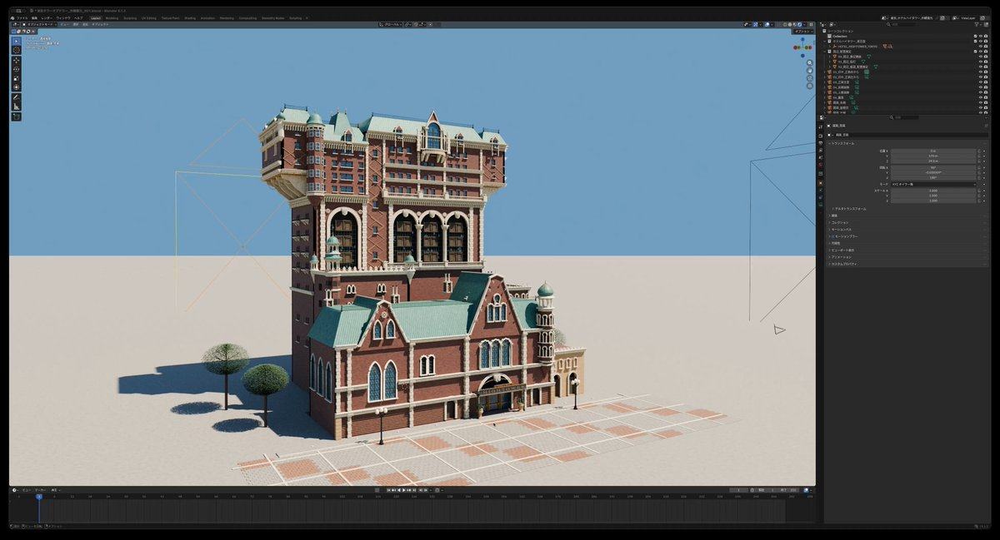

# Astra · プロンプト集 · Leadde.ai

[](README.md) [](README_zh.md) [](README_zh-TW.md) [](README_ja-JP.md) [](README_ko-KR.md) [](README_th-TH.md) [](README_vi-VN.md) [](README_hi-IN.md) [](README_es-ES.md) [-lightgrey)](README_es-419.md) [](README_de-DE.md) [](README_fr-FR.md) [](README_it-IT.md) [-lightgrey)](README_pt-BR.md) [](README_pt-PT.md) [](README_tr-TR.md)

**Best for:** Astra prompts for 3D scenes, Blender workflows, game assets, and agent-led visual production.

For PDF, PPT, SOP, training, and multilingual video workflows:
[Awesome Document-to-Video](https://github.com/LeaddeOpenLab/awesome-document-to-video)

> **高品質なプロンプトを毎日厳選**

AI画像・動画・3D制作の完全なプロンプトを紹介します。スタイル別に探し、多言語版と原作者の出典を確認できます。

[Leadde.ai を見る →](https://leadde.ai/?utm_source=github&utm_medium=readme&utm_campaign=prompt-library&utm_content=astra)

## Leadde.ai について

Leadde.ai は文書、スライド、テキストから、研修、新入社員教育、マーケティング向けのAIビジネス動画を作成するチームを支援します。

リポジトリにスターを付けて、毎日の厳選プロンプトから新しい創作のアイデアを見つけましょう。

**2** 件 · 最新の追加: **2026-09-09**

<a name="catalog"></a>

## カテゴリから探す

[イラスト](#category-illustration) · [3D レンダリング](#category-3d-render)

<a name="all-prompts"></a>

<a name="category-illustration"></a>

## イラスト

<a name="prompt-2096842636074312057"></a>

### 基于两张参考图（卡通角色与X个人主页UI）生成15秒定机位2D动画，角色从头像框爬出并撕除清扫原文字，随后手写个性标语占领主页。

作者：[@Chengzilhy](https://x.com/Chengzilhy) · [元の投稿](https://x.com/Chengzilhy/status/2096842636074312057)

プロフィール / アバター · アプリ / Web デザイン · 写真撮影 · イラスト · キャラクター · 配信済み

元の投稿：[@Chengzilhy](https://x.com/Chengzilhy) · [元の投稿](https://x.com/Chengzilhy/status/2096456212246364322)

**概要:** 基于两张参考图（卡通角色与X个人主页UI）生成15秒定机位2D动画，角色从头像框爬出并撕除清扫原文字，随后手写个性标语占领主页。


**プロンプト**

```text
【参考图定义】
Image1＝李韭二卡通角色｜唯一角色参考

Image1 是整段视频中唯一且最高优先级的人物身份、脸部、发型、服装与画风参考。

全程严格保持 Image1 中李韭二的：

可辨识脸部特征
五官比例
短发
黑框眼镜
深色短袖上衣
深色长裤
黑色鞋子
扁平简洁的卡通插画质感
理性、轻松、带一点幽默感的气质

禁止：

真人化
3D化
别人化
改发型
改服装
改画风
Image2＝X个人主页截图｜唯一背景与布局参考

Image2 是整段视频唯一的背景、UI、版式与构图参考。

严格保持 Image2 中的：

顶部横幅图片
头像圆框的位置
白色 UI 背景
所有按钮
图标
页面结构
留白
颜色
比例

整段视频里，相机完全固定。

X 个人主页从第一帧到最后一帧始终保持正面、水平、全屏固定，页面四边始终与视频画框平行。

禁止对整个页面做任何：

缩放
平移
旋转
倾斜
透视变化
重构

禁止整个主页向左或向右倾斜。
 禁止页面缩小后露出新的外部灰色背景。
除指定表演外，UI 和背景不得改变。

【整体要求】

生成一段 15 秒、9:16 竖屏、固定机位、2D卡通动画感 的短视频。

整段视频中：

背景始终是 Image2 的 X 主页截图

动起来的只有角色与被操作的文字
角色一开始位于头像圆框内
角色形象必须替换为 Image1 的李韭二卡通形象
头像圆框位置和页面本身始终不变
整体节奏轻快、清晰、带一点喜剧感
无对白
无旁白
无对话气泡
无额外字幕
不新增无关人物
不新增无关 logo
不新增无关文字
【时间轴动作设计】
【0.0～2.3 秒】
整个 X 页面保持完全固定。

只有头像圆框内部开始动起来。

圆框里的李韭二先轻微眨眼，表情自然平静。

然后微微转眼看看四周页面，抬手轻轻推一下眼镜。

接着低头看一眼页面上的文字内容，像是在观察这个主页，最后再看向镜头，嘴角露出一点“我有主意了”的淡淡笑意。

动作自然、克制、利落。

不要夸张变形。

不要大幅摆动。

【2.3～4.0 秒】

李韭二双手扶住头像圆框边缘，把头像圆框当作一个小入口，从里面自然地钻出来。

动作顺序清楚表现为：

双手扶住圆框

上半身先探出来
一只脚先跨出来
另一只脚再跟出来
他自然地从头像中出来
最后来到 X 页面下方的白色留白区域上
落地时角色动作要自然轻巧，手臂、身体和眼镜有轻微自然跟随动作。

只有角色从头像中出来。

头像圆框本身仍保留在原位，不变形、不消失。

页面本身不能发生任何结构变化。

整个过程中，X 个人主页始终保持正面、水平、全屏固定，不允许向左或向右倾斜，不产生透视变化。

【4.0～7.6 秒】

李韭二落地后左右看看，发现页面上有很多文字，立刻露出“开始整理一下”的轻松表情。

他开始把页面中的文字一段一段撕下来。

可操作对象为页面内所有 可读文字 / 字母 / 数字，例如：

个人主页名称

用户ID
简介文字
加入时间
关注数
粉丝数
按钮里的文字
帖子内容文字
其他 readable text / letters / numbers
只撕 3 次，动作明确、节奏利落：

第 1 次

他走到页面名字区域附近，用两根手指捏住一整段文字，像撕贴纸一样清楚地把文字从页面表面撕下来。

撕下来的文字在他手里立刻变成一张小小的便签卡片。

他用两根手指夹住卡片，像弹扑克牌一样，把卡片朝镜头方向利落地弹出去。

卡片从前景掠过并飞出画面。

对应原文字位置立刻变成白色空白。

第 2 次

他撕下一段简介文字。

这次动作更熟练，边走边让撕下来的文字变成便签卡片。

然后干脆地朝镜头另一侧弹出去。

卡片从画面前景飞过。

对应位置的文字同步消失，只留下空白。

第 3 次

他撕下帖子区域较大的一块文字。

这块文字稍微大一些，会变成稍大一点的便签卡片。

他先做一个“准备弹出去”的小动作，再突然朝镜头方向弹过来。

卡片快速朝镜头放大，然后飞出画面。

对应原文字区域彻底变成白色空白。

第 3 次弹完之后，他满意地轻轻拍一下手。

重要要求

文字必须像纸贴一样被掀起、撕下
不能直接消失
便签卡片必须由撕下来的文字变成
每弹走一张便签卡片，对应原文字位置必须真实留白
便签卡片不要大到遮挡全画面
只允许去除文字
以下元素必须保留：

顶部横幅插画

头像圆框
图片区域
所有图形图标
按钮外框
分割线
缩略图
其他非文字视觉元素
【7.6～10.4 秒】
他看了一圈页面，发现还有许多残余文字。

脸上的轻松表情稍微收住，露出一点“剩下的还是有点多”的表情。

他从身后拿出一个 简单的滚筒 / 刮板 / 白板擦。

接着进行 3 次轻快清屏动作：

第 1 下

从页面上方横向一刮。

一整排残余文字像薄薄的纸片一样被带走。

第 2 下

从页面中部向下斜刮。

剩余文字继续被聚拢，往页面一侧堆积。

第 3 下

朝页面右下方做一次干脆的收尾清理。

最后一堆残余文字整体被清出画面。

清理完成后，他轻轻收一下工具，像是满意地收尾。

重要要求

只有被滚筒 / 刮板 / 白板擦碰到的文字才会消失
文字必须随着工具动作被聚拢、被清走
不能突然无缘无故消失
工具只能在便签卡片动作结束后才出现
工具只有一个，不能增殖
清理完之后，页面中的旧文字必须全部清空。

页面上只剩：

背景图片

UI 图形图标
按钮轮廓
图片元素
大面积干净白色留白
清理过程中，整个 X 页面本身绝对不移动、不倾斜、不旋转。

【10.4～13.7 秒】

他把工具轻轻放到一边，低头从身上拿出一支 粗黑色马克笔。

他“啪”地打开笔帽，转身面对清空后的大面积白色留白区域。

然后 由李韭二这个动画人物自己亲手写字。

他用粗黑色手写马克笔，在页面中央到下方的大面积空白区域里，分两行写下：

这里归李韭二了！

欢迎来聊 AI

这两句文字必须清楚、准确、完整显示。

不得错字。

不得漏字。

不得乱码。

不得替换成别的句子。

不得增加任何其他新文字。

文字样式要求：

黑色

粗马克笔手写感
一笔一笔自然写出
足够大
清晰易读
占据画面明显位置
书写过程必须能清楚看见笔尖推进，字是被一笔一笔写出来的，不是瞬间出现的。

写字的人必须是李韭二本人。
 写字的手必须是角色自己的手。
 禁止任何画外手、悬空手、真实手。

【13.7～15.0 秒】
写完后，他把马克笔盖重新盖上。
先后退一小步，满意地看一眼自己的“杰作”。

然后他一只手自然拿着马克笔，微微侧身。

接着转头看向镜头，轻轻推一下眼镜，露出一个淡淡的、轻松的、带一点掌控感的微笑。

不是夸张大笑，而是自然、轻松、写完之后很满意的表情。

最后约 0.7 秒静止定格。

定格画面中必须同时清楚看到：

页面上的两行大字：
 这里归李韭二了！
 欢迎来聊 AI

看向镜头、轻推眼镜、淡淡微笑的李韭二

被清空文字后的 X 页面背景

【强制约束】
只使用 Image1 和 Image2 两张参考图
Image1 是唯一角色参考
Image2 是唯一背景 / UI / 布局参考
摄影机全程完全固定
X 个人主页从第一帧到最后一帧始终保持正面、水平、全屏固定
页面四边始终与视频画框平行
禁止整个主页向左或向右倾斜
禁止页面缩小后露出新的外部灰色背景
不改变原截图构图、顶部横幅、UI位置
不提前删除文字
前半段必须是“撕文字 → 变便签卡片 → 朝镜头弹出”
中段必须用滚筒 / 刮板 / 白板擦清理剩余文字
工具必须在便签卡片动作结束后才出现
清扫完成后再拿出马克笔
旧文字最后必须全部消失
只删除文字，不删除图片、图标、按钮、边框、线条等非文字元素
最终页面上只保留新写的两行文字：
 这里归李韭二了！
 欢迎来聊 AI
保持 Image1 角色的脸、眼镜、发型、服装、画风和插画质感
不得真人化
不得3D化
不得变成别人
不得增加多余人物
不得增加多余手臂、手指或腿
不得让工具或马克笔重复生成
不得出现画外手帮忙写字
必须是动画人物自己写字
不得生成新的 logo 或无关文字
禁止乱码
无对白
无旁白
无对话气泡
```

[↑ カテゴリに戻る](#catalog)

---

<a name="category-3d-render"></a>

## 3D レンダリング

<a name="prompt-2097575421944738252"></a>

### 翻訳中

作者：[@satoh\_sama4](https://x.com/satoh_sama4) · [元の投稿](https://x.com/satoh_sama4/status/2097575421944738252)

3D レンダリング · 建築 / インテリア · 配信済み

**概要:** 翻訳中



**プロンプト**

```text
翻訳中
```

[↑ カテゴリに戻る](#catalog)

---

[Leadde.ai を見る →](https://leadde.ai/?utm_source=github&utm_medium=readme&utm_campaign=prompt-library&utm_content=astra)
