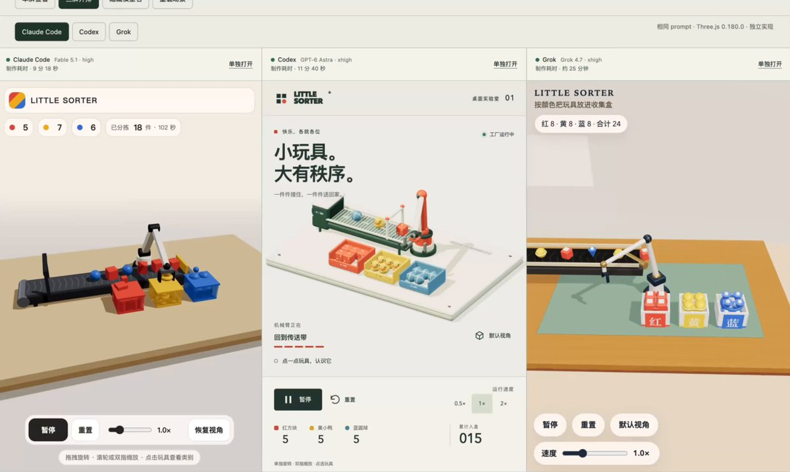
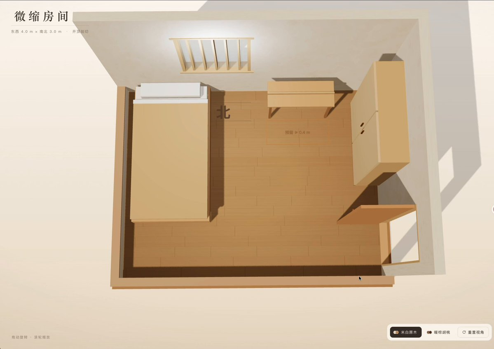
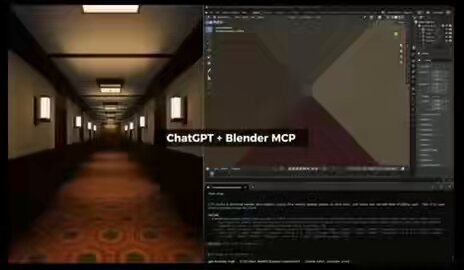

# Astra · Biblioteca de prompts · Leadde.ai

[](README.md) [](README_zh.md) [](README_zh-TW.md) [](README_ja-JP.md) [](README_ko-KR.md) [](README_th-TH.md) [](README_vi-VN.md) [](README_hi-IN.md) [](README_es-ES.md) [-lightgrey)](README_es-419.md) [](README_de-DE.md) [](README_fr-FR.md) [](README_it-IT.md) [-lightgrey)](README_pt-BR.md) [](README_pt-PT.md) [](README_tr-TR.md)

**Best for:** Astra prompts for 3D scenes, Blender workflows, game assets, and agent-led visual production.

For PDF, PPT, SOP, training, and multilingual video workflows:
[Awesome Document-to-Video](https://github.com/LeaddeOpenLab/awesome-document-to-video)

> **Prompts de qualidade selecionados diariamente**

Descubra prompts completos para imagens, vídeos e criações 3D com IA. Explore por estilo, consulte versões multilingues e conheça os autores e as fontes.

[Explore a Leadde.ai →](https://leadde.ai/?utm_source=github&utm_medium=readme&utm_campaign=prompt-library&utm_content=astra)

## Conheça a Leadde.ai

A Leadde.ai ajuda equipas a transformar documentos, diapositivos e textos em vídeos empresariais com IA para formação, integração e marketing.

Adicione uma estrela a este repositório para acompanhar a nossa seleção diária de prompts e descobrir novas ideias.

**13** Prompts · Adição mais recente: **2026-09-21**

<a name="catalog"></a>

## Explorar por categoria

[Cena de Cinema / Fotograma](#category-cinematic-film-still) · [Ilustração](#category-illustration) · [Banda Desenhada / Romance Gráfico](#category-comic-graphic-novel) · [Renderização 3D](#category-3d-render)

<a name="all-prompts"></a>

<a name="category-cinematic-film-still"></a>

## Cena de Cinema / Fotograma

<a name="prompt-2097777121452347846"></a>

### Crie uma imagem de storyboard de 24 fotogramas contendo 24 capturas de ecrã de um potencial filme reboot de Seinfeld.

Autor：[@VK10920178](https://x.com/VK10920178) · [Publicação original](https://x.com/VK10920178/status/2097777121452347846)

Banda desenhada / Storyboard · Cena de Cinema / Fotograma · Publicado

**Resumo:** Crie uma imagem de storyboard de 24 fotogramas contendo 24 capturas de ecrã de um potencial filme reboot de Seinfeld.


**Prompt**

```text
Crie uma imagem de storyboard de 24 fotogramas contendo 24 capturas de ecrã de um potencial filme reboot de Seinfeld.
```

[↑ Voltar às categorias](#catalog)

---

<a name="category-illustration"></a>

## Ilustração

<a name="prompt-2096842636074312057"></a>

### Tradução em curso

Autor：[@Chengzilhy](https://x.com/Chengzilhy) · [Publicação original](https://x.com/Chengzilhy/status/2096842636074312057)

Perfil / Avatar · Design de Aplicações / Web · Fotografia · Ilustração · Personagem · Publicado

Publicação original：[@Chengzilhy](https://x.com/Chengzilhy) · [Publicação original](https://x.com/Chengzilhy/status/2096456212246364322)

**Resumo:** Tradução em curso


**Prompt**

```text
Tradução em curso
```

[↑ Voltar às categorias](#catalog)

---

<a name="category-comic-graphic-novel"></a>

## Banda Desenhada / Romance Gráfico

<a name="prompt-2097718063663858058"></a>

### Anúncio de pastilha elástica escolar de 30 segundos: um estudante tímido intimidado mastiga pastilha “RAZOR” para recuperar a confiança, exibe manobras de skate para superar o rufia e impressionar uma rapariga ruiva, com efeitos de banda desenhada em amarelo e preto e encerramento com o slogan do produto.

Autor：[@higgsfield\_ai](https://x.com/higgsfield_ai) · [Publicação original](https://x.com/higgsfield_ai/status/2097718063663858058)

Banda Desenhada / Romance Gráfico · Personagem · Produto · Publicado

**Resumo:** Anúncio de pastilha elástica escolar de 30 segundos: um estudante tímido intimidado mastiga pastilha “RAZOR” para recuperar a confiança, exibe manobras de skate para superar o rufia e impressionar uma rapariga ruiva, com efeitos de banda desenhada em amarelo e preto e encerramento com o slogan do produto.


**Prompt**

```text
Crie um anúncio cinematográfico de pastilha elástica de 30 segundos ambientado no pátio de uma escola. Um estudante tímido com uma camisa roxa é intimidado por atletas com casacos universitários verdes. Um amigo dá-lhe pastilha elástica “RAZOR” numa embalagem amarela. Ele mastiga-a, ganha confiança, realiza manobras incríveis de skate, passa a perna ao rufia e impressiona uma rapariga ruiva. Utilize visuais realistas, movimentos rápidos de câmara, humor brincalhão e efeitos de banda desenhada em amarelo e preto. Termine com o pacote de pastilhas e o slogan.
```

[↑ Voltar às categorias](#catalog)

---

<a name="category-3d-render"></a>

## Renderização 3D

<a name="prompt-2102091619973427380"></a>

### Tradução em curso

Autor：[@yrzhe\_top](https://x.com/yrzhe_top) · [Publicação original](https://x.com/yrzhe_top/status/2102091619973427380)

Renderização 3D · Publicado

**Resumo:** Tradução em curso



**Prompt**

```text
Tradução em curso
```

[↑ Voltar às categorias](#catalog)

---

<a name="prompt-2100136611166007364"></a>

### Prompt a instruir uma IA a reconstruir uma cena 3D interativa com movimentos articulados a partir da fotografia de uma divisão.

Autor：[@walterzhu8](https://x.com/walterzhu8) · [Publicação original](https://x.com/walterzhu8/status/2100136611166007364)

Fotografia · Renderização 3D · Publicado

**Resumo:** Prompt a instruir uma IA a reconstruir uma cena 3D interativa com movimentos articulados a partir da fotografia de uma divisão.


**Prompt**

```text
A partir da fotografia da divisão que forneci, utiliza o Blender MCP para construir uma cena 3D interativa e renderiza-a num vídeo de demonstração. Inclui movimento de objetos articulados (dobradiças, portas, gavetas) e utiliza movimentos de câmara sensatos para mostrar estes efeitos.
```

[↑ Voltar às categorias](#catalog)

---

<a name="prompt-2100028214659932570"></a>

### Geração guiada por prompt de página interativa 3D em Three.js de um quarto em miniatura, com mudança de esquema de cores e interação básica de perspetiva.

Autor：[@wangdefou](https://x.com/wangdefou) · [Publicação original](https://x.com/wangdefou/status/2100028214659932570)

Fotografia · Renderização 3D · Publicado

**Resumo:** Geração guiada por prompt de página interativa 3D em Three.js de um quarto em miniatura, com mudança de esquema de cores e interação básica de perspetiva.



**Prompt**

```text
Utilize frontend-design para criar uma página web em Three.js com base na imagem da divisão e na disposição verificada.
O estilo é um quarto em miniatura acolhedor, em tons de branco suave e madeira, com um painel de controlo conciso em chinês.
Utilize geometrias simples para criar a cama, secretária, roupeiro, portas e janelas, sem depender de modelos 3D externos.
Implemente apenas rotação por arrasto, zoom com a roda do rato, alternância entre dois esquemas de cores e reposição de perspetiva.
Mantenha a disposição confirmada; liste como suposições quaisquer alturas ou materiais não fornecidos.
Após a criação, execute a página localmente para verificar a interação e preserve a primeira versão.
Se houver problemas, faça as correções com base em capturas de ecrã reais ou mensagens de erro.
```

[↑ Voltar às categorias](#catalog)

---

<a name="prompt-2099588840419651890"></a>

### Prompt para gerar uma cena 3D de corredor de hotel.

Autor：[@MyWestLord](https://x.com/MyWestLord) · [Publicação original](https://x.com/MyWestLord/status/2099588840419651890)

Renderização 3D · Publicado

Publicação original：[@MyWestLord](https://x.com/MyWestLord) · [Publicação original](https://x.com/MyWestLord/status/2098109848118280487)

**Resumo:** Prompt para gerar uma cena 3D de corredor de hotel.



**Prompt**

```text
criar cena de corredor de hotel
```

[↑ Voltar às categorias](#catalog)

---

<a name="prompt-2097864183773618361"></a>

### Simulação de voo de colheita num prado de flores silvestres da perspetiva da abelha com interface de fixação de alvo.

Autor：[@prompts\_ig](https://x.com/prompts_ig) · [Publicação original](https://x.com/prompts_ig/status/2097864183773618361)

Design de Aplicações / Web · Renderização 3D · Publicado

**Resumo:** Simulação de voo de colheita num prado de flores silvestres da perspetiva da abelha com interface de fixação de alvo.


**Prompt**

```text
Siga uma rota simulada de recolha de pólen através de um prado de flores silvestres, com uma sobreposição de pesquisa que destaca uma flor à medida que a abelha se aproxima.
```

[↑ Voltar às categorias](#catalog)

---

<a name="prompt-2097817422485160261"></a>

### Instruções para modelar uma cadeira de escritório no Maya, configurar texturas e renderizar um turntable com Arnold

Autor：[@yuukixx\_vrc](https://x.com/yuukixx_vrc) · [Publicação original](https://x.com/yuukixx_vrc/status/2097817422485160261)

Renderização 3D · Publicado

**Resumo:** Instruções para modelar uma cadeira de escritório no Maya, configurar texturas e renderizar um turntable com Arnold


**Prompt**

```text
Ligue-se ao commandPort do Maya, modele uma cadeira de escritório comum, configure texturas fotorrealistas e renderize um turntable com o Arnold
```

[↑ Voltar às categorias](#catalog)

---

<a name="prompt-2097743367484621269"></a>

### Instrução para gerar um modelo de terreno 3D tridimensional de uma pequena aldeia numa ilha referenciando a imagem em anexo.

Autor：[@TaroKichijo](https://x.com/TaroKichijo) · [Publicação original](https://x.com/TaroKichijo/status/2097743367484621269)

Renderização 3D · Publicado

**Resumo:** Instrução para gerar um modelo de terreno 3D tridimensional de uma pequena aldeia numa ilha referenciando a imagem em anexo.


**Prompt**

```text
Usa img2threejs/img2threejs para criar o relevo tridimensional desta pequena aldeia na ilha. Por favor, utiliza a imagem em anexo como imagem de referência.
```

[↑ Voltar às categorias](#catalog)

---

<a name="prompt-2097681593246613583"></a>

### Villa moderna, piscina infinita, vista para o oceano.

Autor：[@robinstetic](https://x.com/robinstetic) · [Publicação original](https://x.com/robinstetic/status/2097681593246613583)

Renderização 3D · Arquitetura / Interiores · Paisagem / Natureza · Publicado

**Resumo:** Villa moderna, piscina infinita, vista para o oceano.


**Prompt**

```text
Villa moderna, piscina infinita, vista para o oceano.
```

[↑ Voltar às categorias](#catalog)

---

<a name="prompt-2097620442236555693"></a>

### Prompt para criar uma cena de colocação de uma armadura de ferro no Blender.

Autor：[@chatgpt\_liberty](https://x.com/chatgpt_liberty) · [Publicação original](https://x.com/chatgpt_liberty/status/2097620442236555693)

Renderização 3D · Publicado

**Resumo:** Prompt para criar uma cena de colocação de uma armadura de ferro no Blender.


**Prompt**

```text
Cria uma cena de colocação de uma armadura de ferro no Blender.
```

[↑ Voltar às categorias](#catalog)

---

<a name="prompt-2097575421944738252"></a>

### Modelo 3D do exterior da versão de Tóquio da Tower of Terror

Autor：[@satoh\_sama4](https://x.com/satoh_sama4) · [Publicação original](https://x.com/satoh_sama4/status/2097575421944738252)

Renderização 3D · Arquitetura / Interiores · Publicado

**Resumo:** Modelo 3D do exterior da versão de Tóquio da Tower of Terror


**Prompt**

```text
Cria um modelo 3D do exterior da versão de Tóquio da Tower of Terror
```

[↑ Voltar às categorias](#catalog)

---

[Explore a Leadde.ai →](https://leadde.ai/?utm_source=github&utm_medium=readme&utm_campaign=prompt-library&utm_content=astra)
