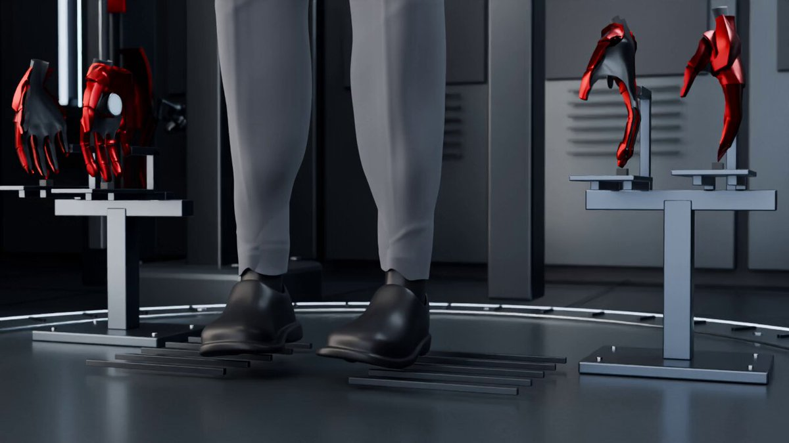

<a name="prompt-2097620442236555693"></a>

### 在 Blender 中创建钢铁装甲穿戴场景的提示词。

作者：[@chatgpt\_liberty](https://x.com/chatgpt_liberty) · [查看 X 原帖](https://x.com/chatgpt_liberty/status/2097620442236555693)

3D 渲染 · 已推流

**概括:** 在 Blender 中创建钢铁装甲穿戴场景的提示词。



**提示词**

```text
用 Blender 制作一段钢铁装甲的着装穿戴场景。
```
