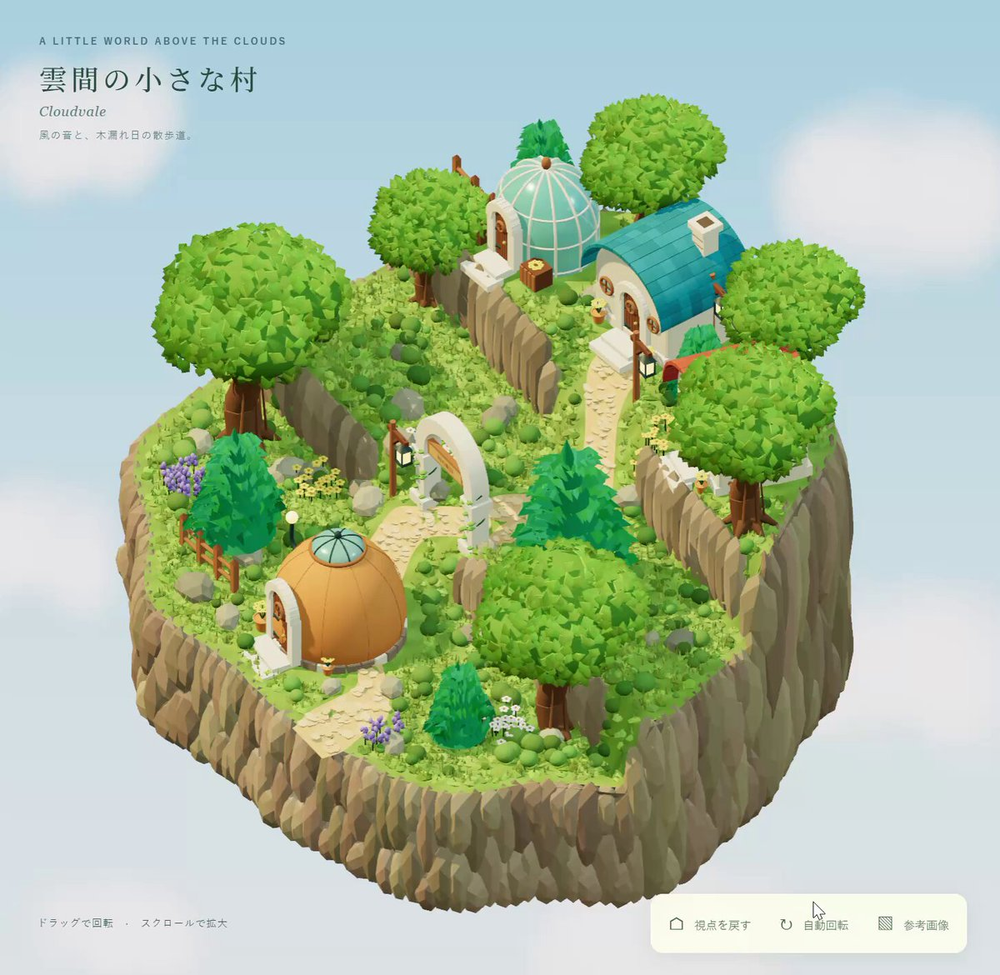

<a name="prompt-2097743367484621269"></a>

### 参考附图生成岛屿小村庄立体3D地形模型的指示。

作者：[@TaroKichijo](https://x.com/TaroKichijo) · [查看 X 原帖](https://x.com/TaroKichijo/status/2097743367484621269)

3D 渲染 · 已推流

**概括:** 参考附图生成岛屿小村庄立体3D地形模型的指示。



**提示词**

```text
使用 img2threejs/img2threejs 制作这个岛屿小村庄的立体地形。参考图像请使用附件。
```
