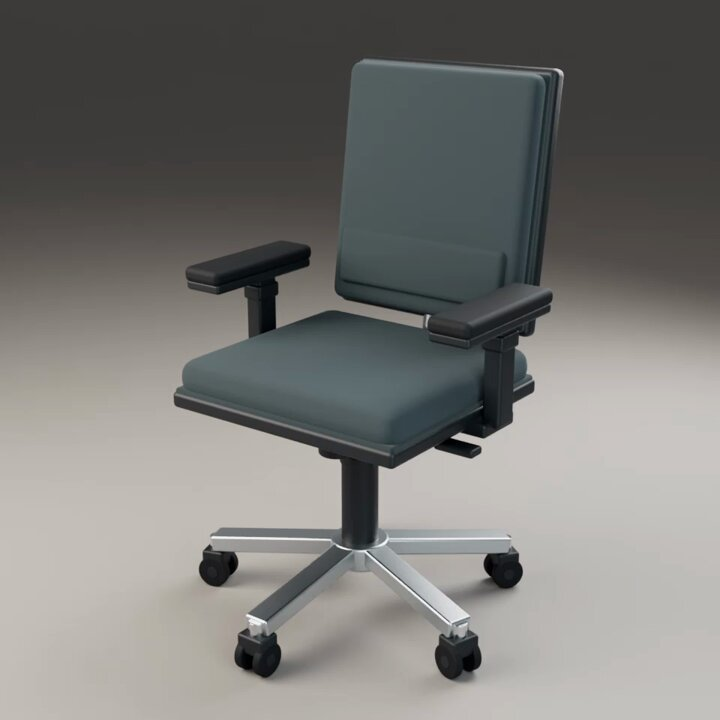

<a name="prompt-2097817422485160261"></a>

### 在Maya中对办公椅建模、设置材质并使用Arnold渲染转盘的指示

作者：[@yuukixx\_vrc](https://x.com/yuukixx_vrc) · [查看 X 原帖](https://x.com/yuukixx_vrc/status/2097817422485160261)

3D 渲染 · 已推流

**概括:** 在Maya中对办公椅建模、设置材质并使用Arnold渲染转盘的指示



**提示词**

```text
连接到Maya的commandPort，对一把普通的办公椅进行建模，设置逼真的逼真材质质感，并使用Arnold渲染转盘动画
```
